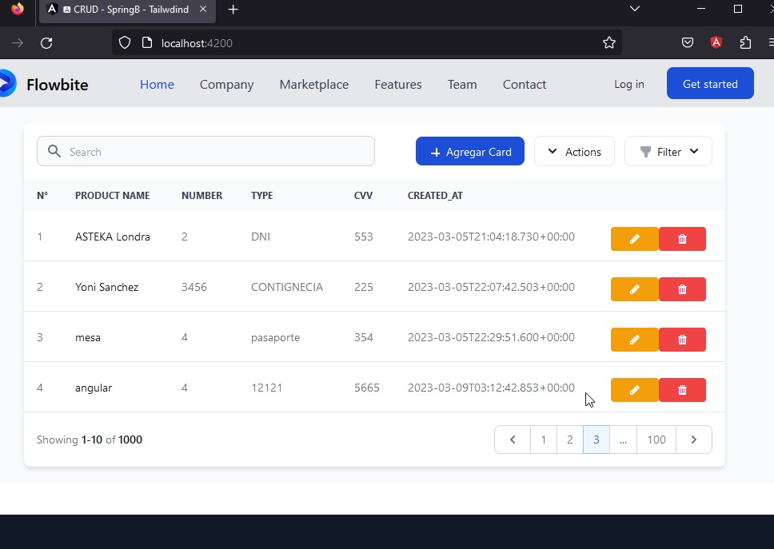

# NgCrudCard

This project was generated with [Angular CLI](https://github.com/angular/angular-cli) version 13.0.4.

## Development server

Run `ng serve` for a dev server. Navigate to `http://localhost:4200/`. The app will automatically reload if you change any of the source files.

## Code scaffolding

Run `ng generate component component-name` to generate a new component. You can also use `ng generate directive|pipe|service|class|guard|interface|enum|module`.

## Build

Run `ng build` to build the project. The build artifacts will be stored in the `dist/` directory.

## Running unit tests

Run `ng test` to execute the unit tests via [Karma](https://karma-runner.github.io).

## Running end-to-end tests

Run `ng e2e` to execute the end-to-end tests via a platform of your choice. To use this command, you need to first add a package that implements end-to-end testing capabilities.

## Further help

To get more help on the Angular CLI use `ng help` or go check out the [Angular CLI Overview and Command Reference](https://angular.io/cli) page.

https://tailblocks.cc/
https://mambaui.com/components/form
https://pinegrow.com/docs/tailwind/tailwind-blocks/

https://betterprogramming.pub/10-open-source-libraries-for-tailwind-css-components-fdbcb692afa9
https://denic.hashnode.dev/tailwind-css-resources

https://builtwithtailwind.com/site/mamba-ui

https://tailwindtemplates.io/templates?category=login

https://flowbite.com/blocks/

====================================
Guia Oficial
https://tailwindcss.com/docs/guides/angular

====================================

>npm install -D tailwindcss postcss autoprefixer

>npx tailwindcss init

====================================

Agregar en tailwind.config.js:

module.exports = {
  content: [
    "./src/**/*.{html,ts}",
  ],
  theme: {
    extend: {},
  },
  plugins: [],
}

====================================
Agregar en src/styles.css

@tailwind base;
@tailwind components;
@tailwind utilities;

